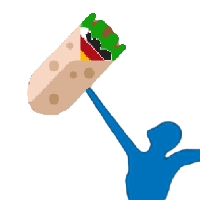
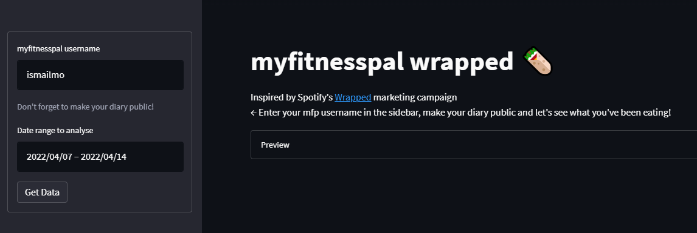
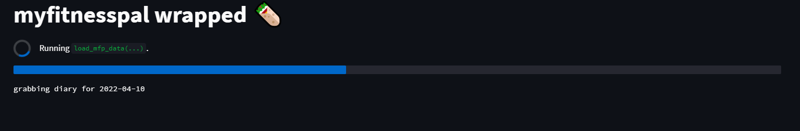
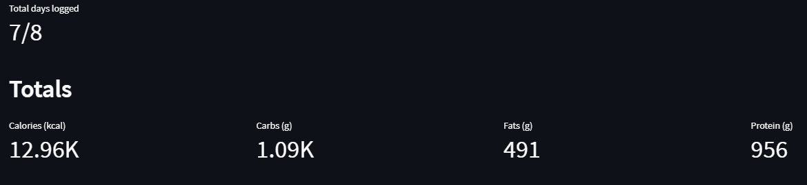
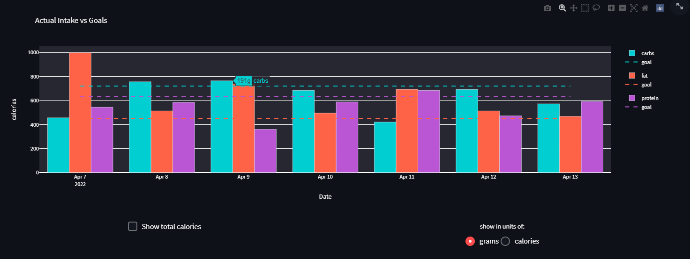
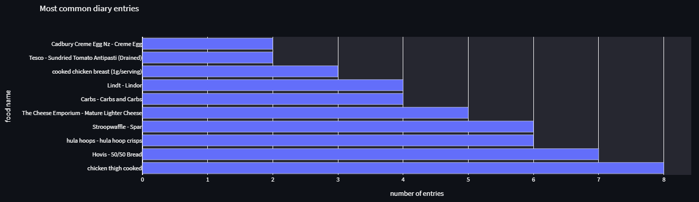

 

  <h1><b>myfitnesspal WRAPPED</b></h1>
 

Visit the live website [here](https://wrapped.ismailmo.com) and try it out for yourself!

Inspired by spotify's wrapped marketing campaign I wanted to create something similar to analyse my eating habits. Many people use myfitnesspal: a food diary app to track their meals and food intake - usually to help them achieve some fitness goal, however myfitnesspal's free tier provides limited capabilities to analyse this data in any meaningful way.

## How it works
1. Make your myfitnesspal diary public so the app can access your food diary.

2. Enter your username and the date range in the sidebar and click 'Get Data'

3. Wait while your diary data is gathered and analysed

## Analysis and Plots

You can view how many days you logged food and your totals

Take a deep dive with this interactive treemap plot of your food intake for each macronutrients (carbohydrates, fats and protein)

Analyse adherence by viewing how well you have been sticking to your goal intake - you can measure by calories or grams for each macronutrient

View your favourite food items by which food items you logged most often in your diary.

